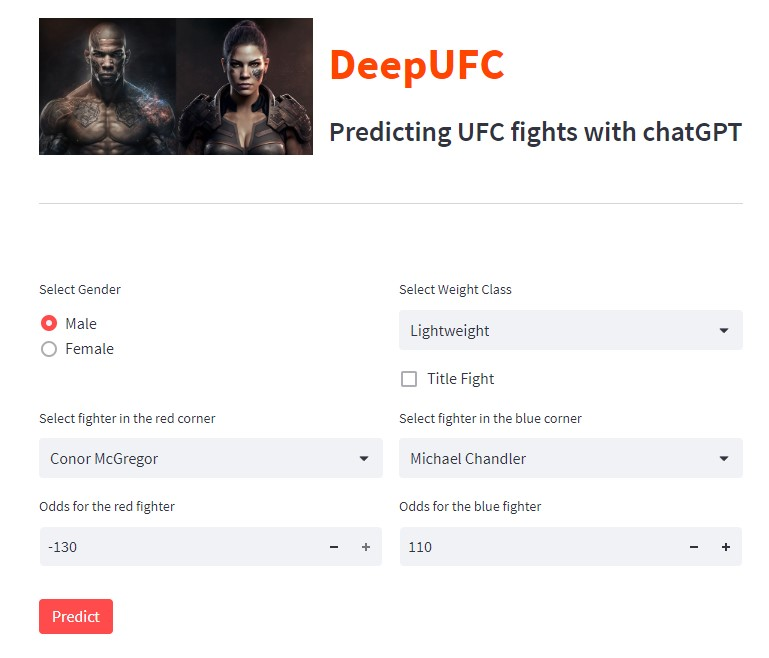

# AI Takes on the UFC: Predict UFC Fight Outcomes with ChatGPT

<!--more-->

&nbsp;&nbsp;&nbsp;&nbsp;&nbsp;&nbsp;&nbsp;&nbsp;If you’re a fan of MMA, you know how unpredictable UFC fights can be. With so many variables at play — fighters’ skills, styles, strategies, injuries, motivation, and more — it can be hard to predict who will come out on top. That’s where [DeepUFC](https://deepufc.streamlit.app) comes in — a Streamlit app that uses chatGPT to predict UFC fight outcomes based on fighters’ attributes and past performances.

ChatGPT is a natural language generation model that can generate coherent and engaging texts on various topics. It is trained on a large corpus of web texts and can learn from its own outputs. I fine-tuned chatGPT on a dataset of UFC fight results and fighter statistics, so that it can generate realistic and relevant predictions for any UFC fight.

Using [DeepUFC](https://deepufc.streamlit.app) is easy. Simply pick two fighters and their fight odds (optional), then click “Predict” and wait for chatGPT to do its magic. The app will display the predicted outcome of the fight, along with a confidence score that indicates how confident chatGPT is about its prediction.

You can check out the app for yourself at https://deepufc.streamlit.app. It’s a simple and user-friendly tool that can help you make more informed predictions about upcoming UFC fights. And as always, feel free to share your feedback and suggestions with me — I’m always looking for ways to improve the app.

So why not give [DeepUFC](https://deepufc.streamlit.app) a try and see how accurate your UFC predictions can be? Happy predicting!

