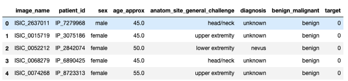
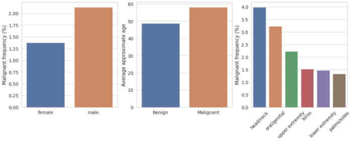
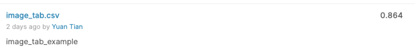

# Integrating image and tabular data for deep learning


<!--more-->

&nbsp;&nbsp;&nbsp;&nbsp;&nbsp;&nbsp;&nbsp;&nbsp;<font size="6">I</font> <font size="4">recently participated in the SIIM-ISIC Melanoma Classification competition on Kaggle. In this competition, participants are asked to identify melanoma in images of skin lesions. Interestingly, they also provide metadata about the patient and the anatomic site in addition to the image. In essence, we have both image and structured or tabular data for each example. For the image, we can use a CNN-based model, and for the tabular data, we can use embeddings and fully connected layers as explored in my previous posts on UFC and League of Legends predictions. It is easy to build two separate models for each data modality. But what if we want to build a joint model that trains on both data modalities simultaneously? There are inspiring discussions in the competition forum including this thread. In this post, I will demonstrate how to integrate the two data modalities and train a joint deep learning model using fastai and the image_tabular library, which I created specifically for these tasks.</font>

## The SIIM-ISIC Dataset
The SIIM-ISIC Melanoma Classification dataset can be downloaded here. The training set consists of 32542 benign images and 584 malignant melanoma images. Please note that this dataset is extremely unbalanced. The picture below shows one example from each class. It seems that malignant lesions are larger and more diffused than benign ones.


As mentioned above, there are metadata available in addition to the images as shown below:



We can perform some basic analysis to investigate whether some of these features are associated with the target. Interestingly, males are more likely to have malignant melanoma than females, and age also seems to be a risk factor of having malignant melanoma as shown below. In addition, the frequency of malignancy melanoma differs between the locations of the imaged site with the head/neck showing the highest malignancy rate. Therefore, these features contain useful information, and combining them with the images could help our model make better predictions. This makes sense as doctors will probably not only examine images of skin lesions but also consider additional factors in order to make a diagnosis.



## The Approach
Our approach to integrating both image and tabular data is very similar to the one taken by the winners of the ISIC 2019 Skin Lesion Classification Challenge as described in their paper and shown in the picture below. Basically, we first load the image and tabular data for each sample, which are fed into a CNN model and a fully connected neural network, respectively. Subsequently, the outputs from the two networks will be concatenated and fed into an additional fully connected neural network to generate final predictions.

 100864")

## Implementation with the image_tabular library
To implement the idea, we will be using Pytorch and fastai. More specifically, we will use fastai to load the image and tabular data and package them into fastai LabelLists.

```python
# load image data using train_df and prepare fastai LabelLists
image_data = (
    ImageList.from_df(
        train_df, path=data_path, cols="image_name", folder="train_128", suffix=".jpg"
    )
    .split_by_idx(val_idx)
    .label_from_df(cols="target")
    .transform(tfms, size=size)
)

# add test data so that we can make predictions
test_image_data = ImageList.from_df(
    test_df, path=data_path, cols="image_name", folder="test_128", suffix=".jpg"
)
image_data.add_test(test_image_data)

tab_data = (
    TabularList.from_df(
        train_df,
        path=data_path,
        cat_names=cat_names,
        cont_names=cont_names,
        procs=procs,
    )
    .split_by_idx(val_idx)
    .label_from_df(cols=dep_var)
)

# add test
tab_data.add_test(
    TabularList.from_df(
        test_df,
        cat_names=cat_names,
        cont_names=cont_names,
        processor=tab_data.train.x.processor,
    )
)
```

Next, we will integrate the two data modalities using the image_tabular library, which can be installed by running:

`pip install image_tabular`

We will use the get_imagetabdatasets function from image_tabular to integrate image and tabular LabelLists.

```python
integrate_train, integrate_valid, integrate_test = get_imagetabdatasets(
    image_data, tab_data
)

# package train, valid, and test datasets into a fastai databunch
db = DataBunch.create(
    integrate_train, integrate_valid, integrate_test, path=data_path, bs=bs
)
```

The databunch contains both image and tabular data and is ready to be used for training and prediction.

Once the data is ready, we can then move on to build the model. First, we need to create a CNN model, resnet50 in this case, and a tabular model using fastai. We will treat sex and anatomic site as categorical features and represent them using embeddings in the tabular model.

```python
# cnn model for images, use Resnet50 as an example
cnn_arch = models.resnet50

# cnn_out_sz is the output size of the cnn model that will be concatenated with tabular model output
cnn_out_sz = 256

# use fastai functions to get a cnn model
image_data_db = image_data.databunch()
image_data_db.c = cnn_out_sz
cnn_learn = cnn_learner(image_data_db, cnn_arch, ps=0.2)
cnn_model = cnn_learn.model

# get embedding sizes of categorical data
emb_szs = tab_data.train.get_emb_szs()

# output size of the tabular model that will be concatenated with cnn model output
tab_out_sz = 8

# use fastai functions to get a tabular model
tabular_model = TabularModel(emb_szs, len(cont_names), out_sz=tab_out_sz, layers=[8], ps=0.2)
```

We are now ready to build a joint model, again using the image_tabular library. We can customize the fully connected layers by specifying the layers parameter.

```python
# get an integrated model that combines the two components and concatenate their outputs
# which will pass through additional fully connected layers
integrate_model = CNNTabularModel(
    cnn_model, tabular_model, layers=[cnn_out_sz + tab_out_sz, 32], ps=0.2, out_sz=2
).to(device)
```

Finally, we can pack everything into a fastai learner and train the joint model.

```python
# package everything in a fastai learner, add auc roc score as a metric
learn = Learner(db, integrate_model, metrics=[accuracy, ROCAUC()], loss_func=loss_func)

# train
learn.fit_one_cycle(10, 1e-4)

# unfreeze all layer groups to train the entire model using differential learning rates
learn.unfreeze()
learn.fit_one_cycle(5, slice(1e-6, 1e-4))
```

The entire workflow is detailed in this Jupyter notebook.

## Results
The model achieved a ROC AUC score of about 0.87 on the validation set after training for 15 epochs. I subsequently submitted the predictions made by the trained model on the test set to Kaggle and got a public score of 0.864. There is definitely much room for improvement.



## Summary
In this post, we used fastai and image_tabular to integrate image and tabular data and built a joint model trained on both data modalities simultaneously. As noted above, there are many opportunities for further improvement. For example, we can try more advanced CNN architectures such as ResNeXt. Another question would be how many neurons should we allocate for image and tabular data before concatenation, in other words, how should we decide the relative importance or weights of the two data modalities? I hope this could serve as a framework for further experimentation and improvement.

## Source Code
The source code of image_tabular and jupyter notebooks for the SIIM-ISIC Melanoma Classification competition can be found [here](https://github.com/naity/image_tabular).

## Acknowledgments
The [image_tabular](https://github.com/naity/image_tabular) library relies on the fantastic [fastai](https://github.com/fastai/fastai) library and was inspired by the [code](https://gist.github.com/jwuphysics/f19162d38e1b4fed0030b96411186c3a) of John F. Wu.
