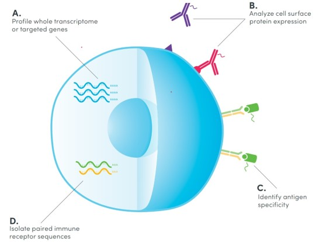
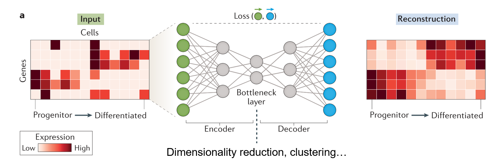
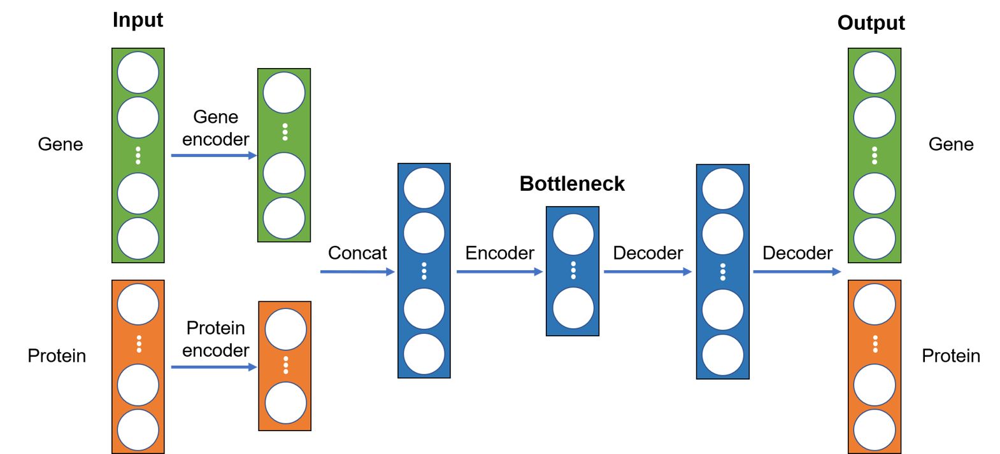
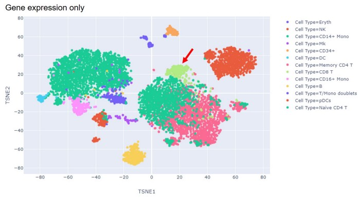
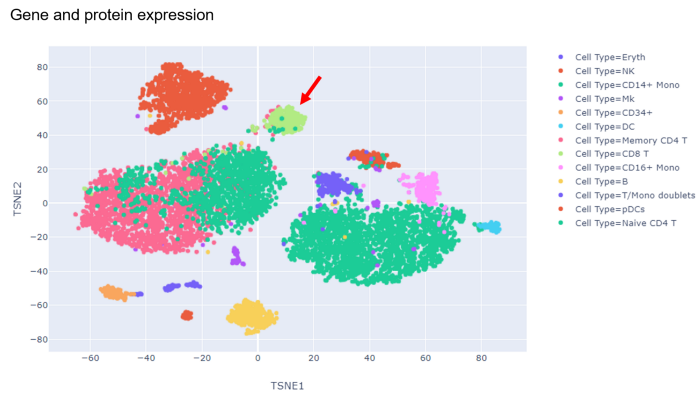

# Integrative analysis of single-cell multi-omics data using deep learning (with video tutorials)

<!--more-->

## Video tutorial #1:



## Video tutorial #2:



&nbsp;&nbsp;&nbsp;&nbsp;&nbsp;&nbsp;&nbsp;&nbsp;Single-cell RNA sequencing (scRNA-seq) has offered a comprehensive and unbiased approach to profile various type of cells such as immune cells with a single-cell resolution using next‑generation sequencing. More recently, exciting technologies such as cellular indexing of transcriptomes and epitopes by sequencing (CITE-seq) have been developed to extend scRNA-seq by jointly measuring multiple molecular modalities such as proteome and transcriptome from the same cell as illustrated in the figure below. By utilizing antibodies that are conjugated to oligonucleotides, CITE-seq simultaneously generates sequencing-based readouts for surface protein expression along with gene expression.

Since gene and protein expressions convey distinct and complementary information about a cell, CITE-seq offers a unique opportunity to combine both transcriptomic and proteomic data to decipher the biology of individual cells at a considerably higher resolution than using either one alone. This requires computational methods that can effectively integrate single-cell data from both modalities. In this tutorial, we will conduct integrative analysis of CITE-seq data using an unsupervised deep learning method named autoencoder.


* Single-cell technologies offer considerable promise in dissecting the heterogeneity among individual cells and are being utilized in biomedical studies at an astounding pace.
* CITE-seq simultaneously measures gene expression and surface protein at a single-cell level.


## Data
We will be using the first CITE-seq dataset published by Stoeckius M et al. in 2017. The authors measured the single-cell transcriptomics of ~8,000 cord blood mononuclear cells (CBMCs) together with the expression of 13 proteins. There are two CSV files — one for gene expression and the other one for protein expression, which can be downloaded from here. Seurat is an R package designed for QC, analysis, and exploration of single-cell genomics data. We will first preprocess the data before feeding them into our autoencoder and to perform cell clustering and annotation based on gene expression using the Seurat package. The code can be found in this accompanying notebook.

After preprocessing, gene and protein expression data are concatenated together, where each column is a gene or protein while each row is a cell (each cell has a unique barcode). The dataset contains the expression levels of 2000 genes and 10 proteins (3 were removed due to poor enrichment) for a total of 7895 cells.



## Autoencoder
Autoencoder is a type of unsupervised deep learning model or neural network that consists of three major components: an encoder, a bottleneck, and a decoder as shown in the figure below. The encoder compresses the input, and the bottleneck layer stores the compressed representation of the input. In contrast, the decoder tries to reconstruct the input based upon the compressed data.

The dimension of the bottleneck layer is normally substantially lower than that of the input. As a result, the encoder will try to learn as much meaningful information about the input as possible while ignoring the noise so that the decoder can do a better job reconstructing the input. Autoencoder can function as a dimensionality reduction algorithm and the low-dimensional representation of the input stored in the bottleneck layer can be used for data visualization and other purposes. Moreover, thanks to its flexible neural network architecture, it offers unlimited ways to incorporate gene and protein expression data as we shall see below.

## Implementation
Since gene and protein data have dramatically different dimensions, we will first encode them separately using two different encoders and then concatenate the outputs, which will be passed through another encoder to generate the bottleneck layer. Subsequently, the decoder will try to reconstruct the input based on the bottleneck layer. The overall neural network architecture is illustrated below:

The implementation of the autoencoder is straightforward using Pytorch and fastai libraries. In this example, the dimensions of the compressed gene and protein data are 120 and 8, respectively, and the bottleneck layer consists of 64 neurons. The entire code can be found in [this (gene only)](https://github.com/naity/citeseq_autoencoder/blob/master/autoencoder_gene_only.ipynb) and [this (gene and protein)](https://github.com/naity/citeseq_autoencoder/blob/master/autoencoder_gene_protein.ipynb) accompanying notebooks.




Updated implementation in Pytorch and [PyTorch Lightning](https://www.pytorchlightning.ai/) can be found in this [Jupyter notebook](https://github.com/naity/citeseq_autoencoder/blob/master/autoencoder_citeseq_saturn.ipynb).


## Results
In addition to the model trained on both gene and protein expression data, we also train a control model using gene expression data only. In this way, we would be able to discern any advantages of performing integrative analysis of CITE-seq data. After training the models, we extract the 64-dimensional compressed representation of the original input stored in the bottleneck layer, which is subsequently visualized on a two-dimensional map generated by t-SNE.

As shown in the figures below, the integrative analysis of both transcriptomic and proteomic data generates better results than using gene expression data alone. For example, CD8 T cell (red arrow) and CD4 T cell clusters together form a large “island” and can’t be separated when only gene expression data is used. In contrast, CD8 T cells (red arrow) form a distinct cluster that is well separated from the CD4 T cell clusters when combining protein expression data with gene expression data. Thus, the combinatory analysis is more efficient at analyzing CITE-seq data than using data from a single molecular modality.

## Summary and Future Directions
Here we built an autoencoder-based deep learning model for dimensionality reduction and visualization of single-cell CITE-seq data. We demonstrate that the integrative analysis of both transcriptomic and proteomic data achieves superior resolution in distinguishing between various immune cell types.

One limitation is that the cells are assigned to different immune cell types during the preprocessing step using the gene expression data alone. It will be of great interest to develop a deep learning model that can also perform cell clustering and characterization using data from multiple molecular modalities.

## Source Code
Data and Jupyter notebooks have been deposited in this [repository](https://github.com/naity/citeseq_autoencoder).
