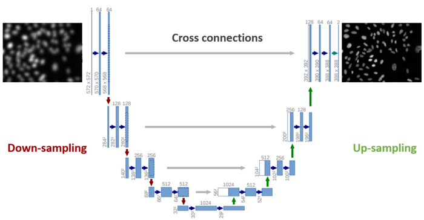

# ReFocus: Making Out-of-Focus Microscopy Images In-Focus Again


<!--more-->

&nbsp;&nbsp;&nbsp;&nbsp;&nbsp;&nbsp;&nbsp;&nbsp;<font size="6">M</font><font size="4">icroscopy images are widely used for the diagnosis of various diseases such as infections and cancers. Furthermore, they facilitate basic biomedical research that has been continuously generating new insights into the causes of human diseases. Therefore, microscopy images are of great importance in improving our health. However, obtaining high-quality in-focus microscopy images poses one of the biggest challenges in the field of microscopy. For example, certain tissues, such as lung and intestines, are uneven and can result in out-of-focus images. In this post, we will tackle this problem by using deep learning to refocus out-of-focus microscopy images. In other words, we will turn out-of-focus microscopy images into in-focus ones (see the figure below) using deep learning.</font>

 

## Data
We will be using the [Broad Bioimage Benchmark Collection 006 (BBBC006)](https://data.broadinstitute.org/bbbc/BBBC006/) image set, which was acquired from one 384-well microplate containing human cells whose nuclei were labeled by Hoechst stains. A z-stack of 32 images (z = 16 at the optimal focal plane, 15 images above the focal plane, and 16 below) was taken for each of the 768 fields of view (384 wells, 2 fields of view per well).

## Approach
The overall strategy is to build a convolutional neural network that takes out-of-focus images as input and generates in-focus images as output. We will base our neural network on the U-net architecture. In addition, we will use feature loss (originally called [perceptual loss by Johnson et al.](https://arxiv.org/pdf/1603.08155.pdf)) as the loss function to quantify the differences between the output of the neural network and its corresponding optimal focal plane image at z = 16, or the target.

## U-net
U-net was originally developed by Ronneberge et al. for biomedical image segmentation problems. U-net essentially consists of three components: a downsampling path that reduces the image size, a subsequent upsampling path that increases the image size, and cross connections that transfer activations from selected parts of the downsampling path to their corresponding parts in the upsampling path. Cross connections supplement the upsampling path with information from the downsampling path and are the major invention that makes U-net perform so well. We will use ResNet-34 pretrained on ImageNet as the downsampling path, which utilizes the technique termed transfer learning.

 

## Feature loss
Feature loss helps reconstruct fine details in images and is well suited to style transfer and super-resolution imaging applications. As shown in the figure below, the basic idea of feature loss is to put the output and target through the same ImageNet model (VGG-16 in our case) and then compare their activations at selected intermediate layers instead of the final layer.

 

## Implementation using fastai
The implementation of our U-net-based neural network is simply one line of code using the fastai library as shown below. We just need to provide the data, downsampling architecture (ResNet-34), loss function (feature loss), and a few additional parameters.

```python
learn = unet_learner(data, models.resnet34,   
                     loss_func=feat_loss,
                     callback_fns=LossMetrics, wd=wd,
                     blur=True, norm_type=NormType.Weight)
```

We will use the implementation of feature loss by Jeremy Howard as shown below:

```python
class FeatureLoss(nn.Module):
    def __init__(self, m_feat, layer_ids, layer_wgts):
        super().__init__()
        self.m_feat = m_feat
        self.loss_features = [self.m_feat[i] for i in layer_ids]
        self.hooks = hook_outputs(self.loss_features, detach=False)
        self.wgts = layer_wgts
        self.metric_names = ['pixel',] + [f'feat_{i}' for i in range(len(layer_ids))
              ] + [f'gram_{i}' for i in range(len(layer_ids))]

    def make_features(self, x, clone=False):
        self.m_feat(x)
        return [(o.clone() if clone else o) for o in self.hooks.stored]
    
    def forward(self, input, target):
        out_feat = self.make_features(target, clone=True)
        in_feat = self.make_features(input)
        self.feat_losses = [base_loss(input,target)]
        self.feat_losses += [base_loss(f_in, f_out)*w
                             for f_in, f_out, w in zip(in_feat, out_feat, self.wgts)]
        self.feat_losses += [base_loss(gram_matrix(f_in), gram_matrix(f_out))*w**2 * 5e3
                             for f_in, f_out, w in zip(in_feat, out_feat, self.wgts)]
        self.metrics = dict(zip(self.metric_names, self.feat_losses))
        return sum(self.feat_losses)
    
    def __del__(self): self.hooks.remove()
```

## Training and testing
We will train our neural network with out-of-focus images that are above the focal plane at z = 1 (the worst), 5 (intermediate), and 10 (close to in-focus)using z = 16 as the ground truth (y). We will set aside a small portion of these images as validation sets and use them to guide and evaluate the training process. After training, we will further assess the model’s performance on out-of-focus images that are below the focal plane at z = 32. Although both are out of focus, images that are above or below the focal plane look different as their distances to the lens are different. Therefore, our strategy will allow us to test the generalizability of the trained model.

## Results
We first evaluate the performance of our model on the validation sets at various out-of-focus levels. As shown below, the model does a good job in distinguishing the blurred cells and the performance improves if we use less blurred images as we would expect.


Next, we examined the model’s performance on the test set at z = 32. As shown below, the image generated by the model closely resembles the optimal focal plane image at z = 16. Thus, our model trained with images that are above the focal plane also performs well on images that are below the focal plane.


## Summary and future directions
In sum, we successfully built a neural network that refocuses blurry out-of-focus microscopy images. This work improves the quality of microscopy images and will facilitate the studies of human diseases. Due to limited computation power, I was only able to work with images of very small size (128*128). Ideally, the neural network should be able to process whole slide images, probably by dividing them into patches. Furthermore, the neural network should be able to handle different kinds of microscopy images with different stains. Finally, we can incorporate the neural network into acquisition platforms to refocus out-of-focus images in real time and eliminate the need for post-acquisition fixation.

## Acknowledgments
I’d like to thank Drs. Paola Marcovecchio, Sara McArdle and Zbigniew Mikulski from the Imaging Core Facility at La Jolla Institute for Immunology (LJI) for helpful discussions.
